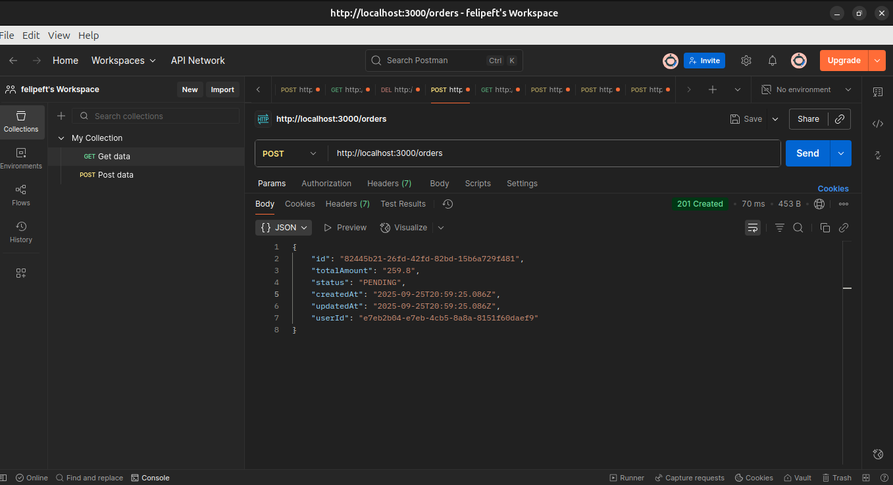
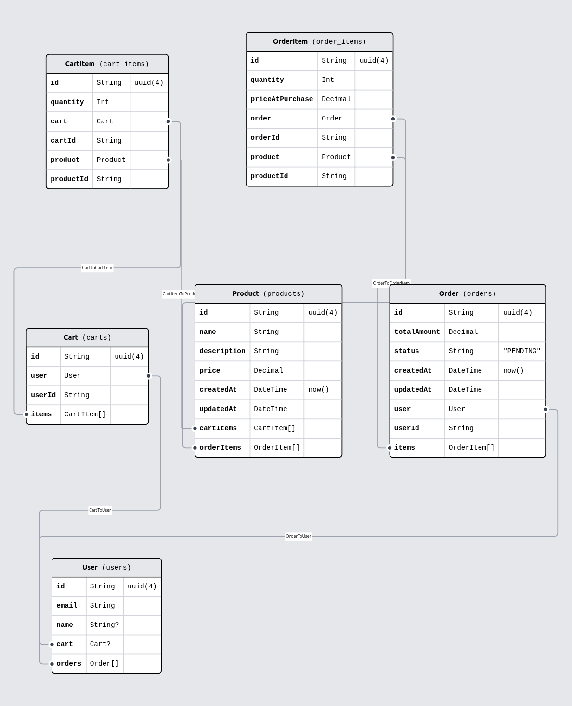

# API de Mini E-commerce com Node.js e TypeScript


## Sobre o Projeto

Esta é uma API REST completa para um sistema de mini e-commerce, desenvolvida como projeto livre de back-end. A aplicação simula a lógica de negócio de uma loja virtual, incluindo gerenciamento de produtos, um sistema de carrinho de compras persistente e um fluxo de checkout para a criação de pedidos.

O projeto foi construído do zero com foco em boas práticas de desenvolvimento, como código modularizado, validação de dados, um ambiente de testes isolado e o uso de Docker para o banco de dados.

---

## Funcionalidades

-   **Gestão de Produtos:** CRUD completo (Criar, Ler, Atualizar, Deletar) para produtos.
-   **Carrinho de Compras:** Adicionar itens, visualizar o conteúdo do carrinho e remover itens. A lógica impede que um mesmo produto seja adicionado duas vezes, atualizando a quantidade.
-   **Fluxo de Checkout:** Rota para transformar um carrinho de compras em um `Pedido` permanente no banco de dados, com cálculo de valor total.
-   **Transações de Banco de Dados:** O processo de checkout é envolto em uma transação Prisma para garantir a integridade dos dados (ou tudo funciona, ou nada é salvo).
-   **Validação de Dados:** As rotas de entrada de dados (`POST` e `PUT`) são protegidas por schemas de validação com **Zod**, prevenindo que dados inválidos cheguem à lógica de negócio.
-   **Testes Automatizados:** Suíte de testes de integração com **Vitest** e **Supertest**, rodando em um banco de dados de teste isolado e temporário para garantir a confiabilidade da API.

---

## Tecnologias Utilizadas

A tabela abaixo lista as tecnologias e ferramentas utilizadas na construção do projeto:

| Ferramenta          | Descrição                                                              |
| ------------------- | ---------------------------------------------------------------------- |
| **Node.js** | Ambiente de execução JavaScript no servidor.                           |
| **TypeScript** | Superset do JavaScript que adiciona tipagem estática.                  |
| **Express.js** | Framework web minimalista para a criação da API.                       |
| **Prisma** | ORM de última geração para a comunicação com o banco de dados.         |
| **PostgreSQL** | Banco de dados relacional, robusto e escalável.                        |
| **Docker** | Ferramenta de containerização para rodar o banco de dados.             |
| **Zod** | Biblioteca para validação de schemas e dados.                          |
| **Vitest** | Framework de testes moderno e rápido.                                  |
| **Supertest** | Biblioteca para testar endpoints HTTP.                                 |

---

## Estrutura do Projeto

A estrutura de pastas foi organizada de forma modular para promover a separação de responsabilidades e a escalabilidade:

```
mini-ecommerce/
│
├── prisma/             # Configurações do Prisma (schema, migrações, seed, setup de testes)
│
├── src/                # Código-fonte da aplicação
│   ├── middlewares/    # Middlewares do Express (ex: validação)
│   ├── routes/         # Arquivos de rotas (produtos, carrinho, pedidos)
│   ├── schemas/        # Schemas de validação com Zod
│   ├── app.ts          # Configuração principal do Express (sem o 'listen')
│   └── server.ts       # Ponto de entrada da aplicação (inicia o servidor)
│
├── .env.example        # Arquivo de exemplo para variáveis de ambiente
├── docker-compose.yml  # Configuração do container do PostgreSQL
├── package.json        # Dependências e scripts do projeto
└── vitest.config.ts    # Configuração do Vitest
```

---

## Como Rodar o Projeto

### Pré-requisitos

-   [Node.js](https://nodejs.org/en/) (v18 ou superior)
-   [Docker](https://www.docker.com/products/docker-desktop) e Docker Compose

### Passos para Instalação

1.  **Clone o repositório:**
    ```bash
    git clone [https://github.com/felipeft/mini-ecommerce.git](https://github.com/felipeft/mini-ecommerce.git)
    cd mini-ecommerce
    ```

2.  **Instale as dependências:**
    ```bash
    npm install
    ```

3.  **Crie os arquivos de ambiente:**
    Copie os arquivos de exemplo `.env.example` para `.env` e `.env.test`.
    ```bash
    cp .env.example .env
    cp .env.example .env.test
    ```
    *Obs: As credenciais padrão já estão configuradas para funcionar com o Docker.*

4.  **Inicie o banco de dados com Docker:**
    ```bash
    docker-compose up -d
    ```

5.  **Aplique as migrações do banco de dados:**
    ```bash
    npx prisma migrate dev
    ```

6.  **(Opcional) Popule o banco com um usuário de teste:**
    ```bash
    npx prisma db seed
    ```

7.  **Inicie o servidor de desenvolvimento:**
    ```bash
    npm run dev
    ```
    A API estará rodando em `http://localhost:3000`.

### Rodando os Testes

Para executar a suíte de testes automatizados, use o comando:
```bash
npm test
```

---

## Uso da API (Exemplos com Postman)

A seguir, exemplos de como interagir com os principais endpoints da API.



**`POST /products`** - Cria um novo produto.

-   **Body:**
    ```json
    {
      "name": "Headset Gamer RGB",
      "description": "Headset com som 7.1 e microfone com cancelamento de ruído.",
      "price": 249.90
    }
    ```
-   **Resposta (201 Created):**
    ```json
    {
      "id": "...",
      "name": "Headset Gamer RGB",
      "description": "Headset com som 7.1 e microfone com cancelamento de ruído.",
      "price": "249.90",
      "createdAt": "...",
      "updatedAt": "..."
    }
    ```

**`POST /cart/add`** - Adiciona um produto ao carrinho.

-   **Body:**
    ```json
    {
      "productId": "ID_DO_PRODUTO_CRIADO_ACIMA",
      "quantity": 1
    }
    ```
-   **Resposta (200 OK):**
    ```json
    {
      "message": "Produto adicionado ao carrinho!"
    }
    ```

**`POST /orders`** - Finaliza a compra (Checkout).

-   Não precisa de Body. A API usa o carrinho do usuário de teste.
-   **Resposta (201 Created):**
    ```json
    {
      "id": "...",
      "totalAmount": "249.90",
      "status": "PENDING",
      "createdAt": "...",
      "updatedAt": "...",
      "userId": "..."
    }
    ```
    *(Após esta chamada, o carrinho do usuário será esvaziado).*

---

## Schema do Banco de Dados

A imagem abaixo ilustra o relacionamento entre as entidades no banco de dados, conforme definido no `schema.prisma`.



